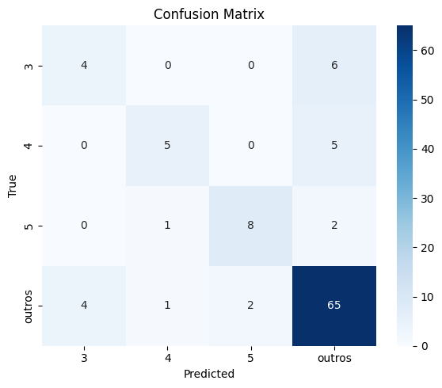

# Classificador de Tipos de Carros

## Objetivo do Projeto
Desenvolver um classificador de tipos de carros utilizando Deep Learning, com foco nas classes `3`, `4`, `5` e agrupamento das demais como `Outros`.

## Leitura e Preparação dos Dados

- O arquivo `.mat` foi utilizado para extrair os metadados de imagens (caminho da imagem, classe).
- As imagens foram padronizadas com base nos caminhos e labels extraídos do `.mat`.
- Classes `3`, `4`, `5` foram mantidas e as demais agrupadas como `"Outros"`.

## Pré-processamento de Imagens

Foi criado o pipeline de pré-processamento:

- **Redimensionamento**: todas as imagens para `224x224`.
- **Conversão de cor**: BGR → RGB.
- **Normalização**: com `mean` e `std` do ImageNet.
- **Denoising**: equalização de histograma no canal Y (espaço YUV).
- **Data Augmentation** (somente no conjunto de treino):
  - Horizontal Flip
  - Random Brightness/Contrast
  - Rotate
  - Coarse Dropout
- **Salvamento estruturado**: subpastas com nomes das classes.

## Divisão dos Dados

- `80%` treino/validação, `20%` teste (com `stratify`).
- Treino (60%) / Validação (20%) / Teste (20%).
- O balanceamento proporcional entre as classes foi mantido.

## Modelo Treinado

- **Arquitetura**: `ResNet18` pré-treinada no ImageNet.
- **Camada final** ajustada para 4 classes.
- **Otimizador**: `Adam`, `learning rate = 1e-4`.
- **Loss Function**: `CrossEntropyLoss` com pesos por classe.

## Problema: Desequilíbrio de Classes

Classes `3`, `4`, `5` apresentavam poucos exemplos em comparação à classe `"Outros"`.

### Soluções aplicadas:

- **Data Augmentation direcionada** para `3`, `4`, `5`.
- **Oversampling com `WeightedRandomSampler`** no DataLoader.
- **Class Weights** na função de perda para penalizar mais erros em classes minoritárias.

### Regularização

O modelo apresentou overfitting, as soluções aplicadas para controle foram:

- **Dropout** adicionado na arquitetura.
- **L2 Regularization** (weight decay) no otimizador.
- Monitoramento do `loss` e estabilização do `val_acc` para controle de overfitting.

## Resultados Finais

### Métricas Gerais

| Métrica    | Valor   |
|------------|---------|
| Accuracy   | 0.7961  |
| Precision  | 0.7859  |
| Recall     | 0.7961  |
| F1-score   | 0.7875  |

### Métricas por Classe

| Classe   | Precision | Recall | F1-score | Suporte |
|----------|-----------|--------|----------|---------|
| 3        | 0.50      | 0.40   | 0.44     | 10      |
| 4        | 0.71      | 0.50   | 0.59     | 10      |
| 5        | 0.80      | 0.73   | 0.76     | 11      |
| Outros   | 0.83      | 0.90   | 0.87     | 72      |

### Médias

| Tipo de Média   | Precision | Recall | F1-score |
|------------------|-----------|--------|----------|
| Macro Average    | 0.71      | 0.63   | 0.67     |
| Weighted Average | 0.79      | 0.80   | 0.79     |

### Matriz de confusão

## Melhorias Futuras para melhora do desempenho do modelo

- Fine-tuning mais profundo (descongelar camadas da ResNet).
- Undersampling da classe "Outros".
- Busca de otimização dos hiperparâmetros com Grid Search ou Optuna.
- Testar outras arquiteturas (EfficientNet, ViT).
- Aumentar o dataset com mais dados reais ou sintéticos.