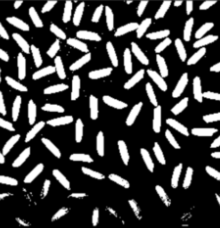
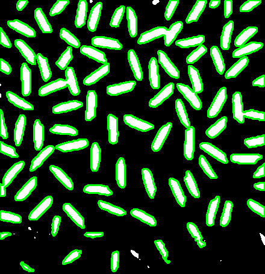

# 🧠 Processamento Digital de Imagens

Este projeto implementa um pipeline em Python utilizando OpenCV para realizar o processamento e a contagem de objetos em uma imagem binária.

A solução foi desenvolvida como parte de um desafio técnico da vaga, atendendo aos seguintes requisitos:

- Ler uma imagem de entrada.
- Converter a imagem para escala de cinza.
- Aplicar filtro de suavização Gaussiano.
- Binarizar a imagem com threshold.
- Detectar e contar objetos com base em contornos.
- Exibir a imagem com os objetos contornados e a contagem anotada.

---

## Etapas do Pipeline

### 1. Input da imagem
A imagem de entrada está localizada no diretório `assets/raw-image.png`.

### 2. Pré-processamento da imagem
O pré-processamento é encapsulado na **classe** **ProcessingImage**, composta pelas seguintes etapas:

    Conversão para escala de cinza.

    Suavização com filtro Gaussiano.

    Binarização automática utilizando o método de Otsu.

### 3. Detecção e contagem de objetos
A detecção e desenho dos contornos de objetos é encapsulada na **classe** **Contours**, composta pelas seguintes etapas:

    Detectar contornos externos na imagem binária.

    Filtrar pequenos ruídos com base na área mínima.

    Desenhar os contornos detectados sobre a imagem original.

### Output
A imagem de saída exibe os objetos contornados em verde.

O total de objetos encontrados foi 87 grãos, após filtragem por área mínima.

